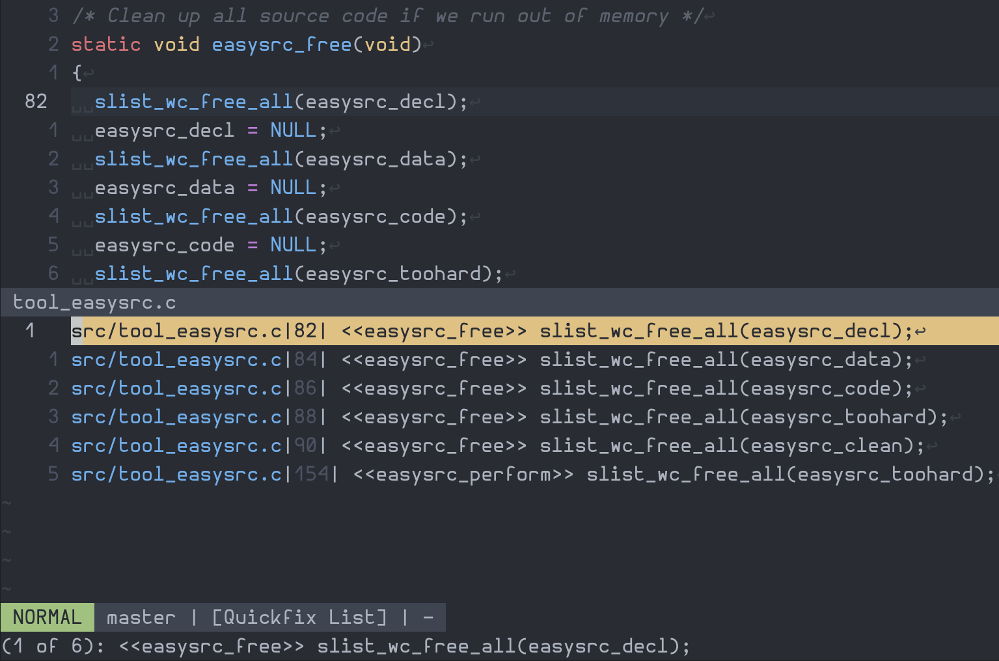
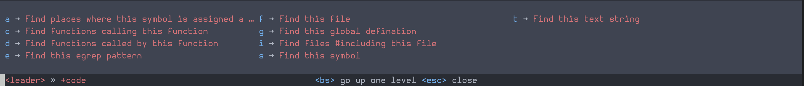
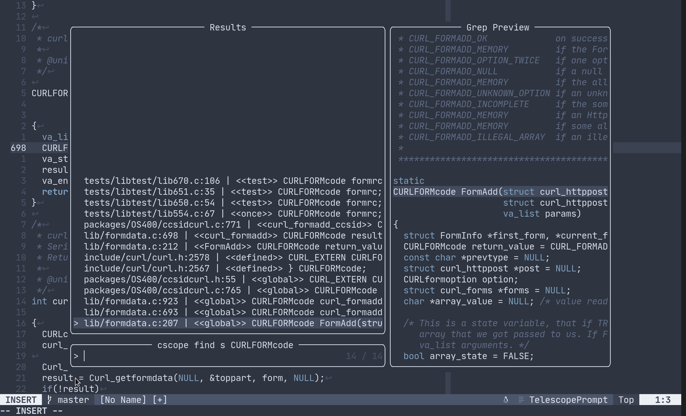

# cscope_maps.nvim
For old school code navigation :)

Only supports [neovim](https://neovim.io/). Heavily inspired by emacs' [xcscope.el](https://github.com/dkogan/xcscope.el).

🌟 Now with `cscope` support for Neovim 0.9+

# 🌟 Cscope support
- Tries to mimic vim's builtin cscope functionality.
- Provides user command, `:Cscope` which acts same as good old `:cscope`.
- No need to add cscope database (`:cscope add <file>`), it is automaticaly picked from current directory or `db_file` option.
- Only want to use Cscope? No worries, keymaps can be disabled using `disable_maps` option.

# Features
* Opens results in quickfix window or **telescope**.
* Has [which-key.nvim](https://github.com/folke/which-key.nvim) hints baked in.
* See [this](https://github.com/dhananjaylatkar/cscope_maps.nvim/edit/main/README.md#vim-gutentags) for `vim-gutentags`.

# Installaion
Install the plugin with your preferred package manager.

## [packer](https://github.com/wbthomason/packer.nvim)
``` lua
-- Lua
use 'dhananjaylatkar/cscope_maps.nvim' -- cscope keymaps
use 'folke/which-key.nvim' -- optional
use 'nvim-telescope/telescope.nvim' -- required for use_telescope option

-- load cscope maps
-- pass empty table to setup({}) for default options
require('cscope_maps').setup({
  disable_maps = false, -- true disables my keymaps, only :Cscope will be loaded
  cscope = {
    db_file = "./cscope.out", -- location of cscope db file
    use_telescope = false, -- true will show results in telescope picker
    db_build_cmd = { -- cmd used for :Cscope build
      exec = "cscope",
      args = { "-bqkv" },
    },
  },
})
```

### If you are lazy-loading which-key.nvim then, load cscope_maps.nvim after which-key.nvim
```lua
use({
  "dhananjaylatkar/cscope_maps.nvim",
  after = "which-key.nvim",
  config = function()
    require("cscope_maps").setup({})
  end,
})
```

## [vim-plug](https://github.com/junegunn/vim-plug)
```vim
" Vim Script
Plug 'dhananjaylatkar/cscope_maps.nvim' " cscope keymaps
Plug 'folke/which-key.nvim' " optional
Plug 'nvim-telescope/telescope.nvim' " required for use_telescope option

lua << EOF
  require("cscope_maps").setup({})
EOF
```

# vim-gutentags

Cscope provided by this plugin is not exactly same as built-in vim cscope, vim-gutentags fails to load.

I have created a [patch](https://github.com/ludovicchabant/vim-gutentags/pull/346) to support this plugin and my fork can be used until it's merged in upstream.

### Config for vim-gutentags
```lua
use({
  "dhananjaylatkar/vim-gutentags",
  after = "cscope_maps.nvim",
  config = function()
    vim.g.gutentags_modules = {"cscope_maps"} -- This is required. Other config is optional
    vim.g.gutentags_cscope_build_inverted_index_maps = 1
    vim.g.gutentags_cache_dir = vim.fn.expand("~/code/.gutentags")
    vim.g.gutentags_file_list_command = "fd -e c -e h"
    -- vim.g.gutentags_trace = 1
  end,
})
```

# Keymaps

### Default Keymaps

| Keymaps | Description |
|--- | --- |
|`<leader>cs`| find all references to the token under cursor |
|`<leader>cg`| find global definition(s) of the token under cursor |
|`<leader>cc`| find all calls to the function name under cursor |
|`<leader>ct`| find all instances of the text under cursor |
|`<leader>ce`| egrep search for the word under cursor |
|`<leader>cf`| open the filename under cursor |
|`<leader>ci`| find files that include the filename under cursor|
|`<leader>cd`| find functions that function under cursor calls |
|`<leader>ca`| find places where this symbol is assigned a value |
|`<leader>cb`| build cscope database |

### Custom Keymaps

Disable default keymaps by setting `disable_maps = true`.

There are 2 ways to add keymaps for `Cscope`.

#### Using `cscope_prompt()` function

`cscope_prompt(operation, default_symbol)` is exposed to user. This function provides prompt which asks for input (see screenshots below) before running `:Cscope` command.

e.g. Following snippet maps <kbd>C-c C-g</kbd> to find global def of symbol under cursor
```lua
vim.api.nvim_set_keymap(
  "n",
  "<C-c><C-g>",
  [[<cmd>lua require('cscope_maps').cscope_prompt('g', vim.fn.expand("<cword>"))<cr>]],
  { noremap = true, silent = true }
) 
```

#### Using `:Cscope` command

Use `vim.api.nvim_set_keymap()` to set keymap for cscope.

e.g. Following snippet maps <kbd>C-c C-g</kbd> to find global def of symbol under cursor
```lua
vim.api.nvim_set_keymap(
  "n",
  "<C-c><C-g>",
  '<cmd>Cscope find g vim.fn.expand("<cword>"))<cr>',
  { noremap = true, silent = true }
) 
```

# Sreenshots

### Asks for input when invoked. (Default input is word/file under cursor)


### Opens results in Quickfix window.



### [which-key](https://github.com/folke/which-key.nvim) hints are baked in.



### Results in telescope picker

